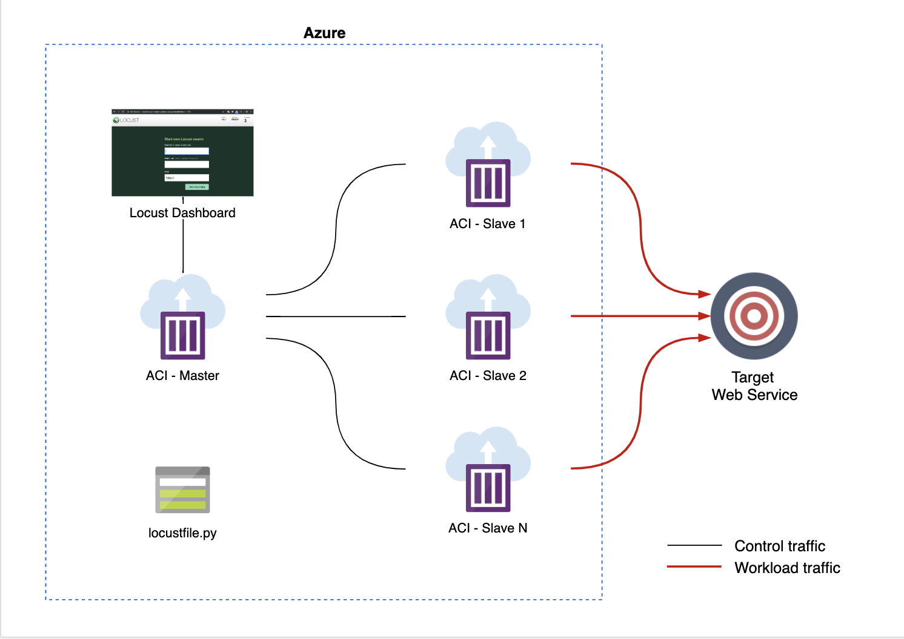
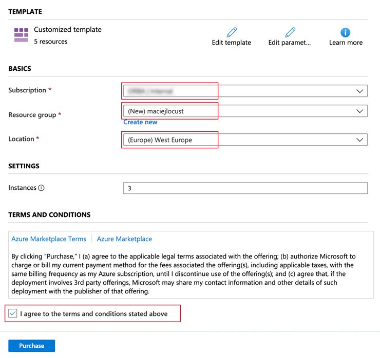
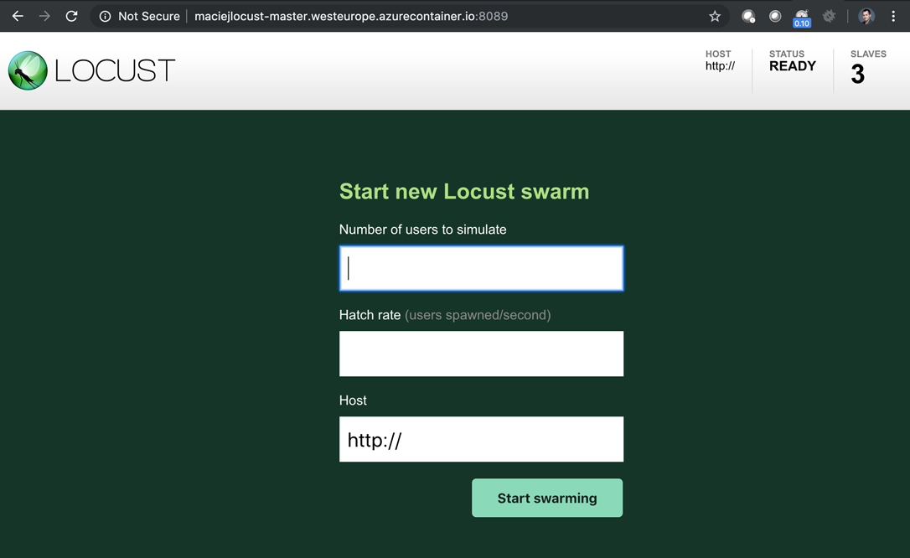
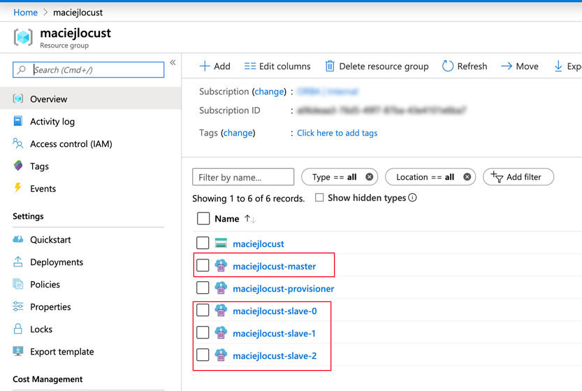
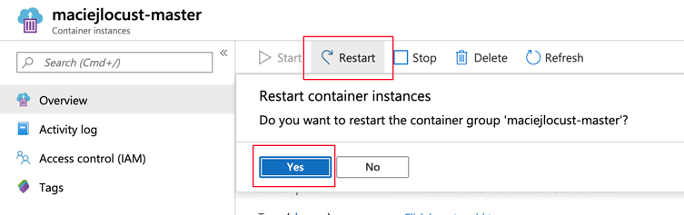
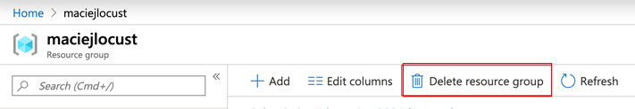

# Azure Locust

Run distributed [Locust](https://locust.io/) load tests on _Azure Container Instances_. It's quick, cheap and scalable! Using 20 slaves you can achive ~12 000 req/s!



You can deploy and manage resources using both: 
* [Azure Portal](https://portal.azure.com) - easier
* [Azure Cli](https://docs.microsoft.com/en-us/cli/azure/install-azure-cli?view=azure-cli-latest) - faster 


## Deployment

**Prefix parameter:** The prefix you choose must be unique across Azure. The prefix also must be between 3 and 24 characters in length, and can include numbers and lowercase letters only. If no prefix - resource group name will be used (if not valid you get an error)! You can verify uniqueness using:

```
az storage account check-name --name <Preifx>
```

Example Prefix: _maciejlocust_

### Azure Portal

Make sure are you logged in [Azure Portal](https://portal.azure.com).

Click magick button:

[](https://portal.azure.com/#create/Microsoft.Template/uri/https%3A%2F%2Fraw.githubusercontent.com%2FORBA%2Fazure-locust%2Fmaster%2Fazuredeploy.json)

- Subscription: choose your subscription
- Resource Group: select existing Resource Group or create new one
- Location: choose West Europe
- Prefix: insert your **Prefix parameter**
- Instances: number of slaves (one slave ~600rps)



Click **Purchase** and wait for deployment ends.

### Azure Cli

Login and set subscription context

```
az login
az account set --subscription <SubscriptionId>
```

**Step 1:** Setup your names
```
export RG=<ResourceGroup>
export PREFIX=<Prefix>
```

**Step 2:** Create Resource Group (if not exists)
```
az group create --name ${RG} --location westeurope
```

**Step 3:** Deploy ARM template
```
az group deployment create --resource-group ${RG} --parameters prefix=${PREFIX} --template-file azuredeploy.json
```
if you want more instance append `--parameters instances=N`

## Go to dashboard

When deployment completes, your load generator is ready. Go to `<Prefix>-master.westeurope.azurecontainer.io:8089`



## Updating script

**Azure Portal:** Go to Azure portal and Storage Account named `<Prefix>sa`. 
Click _File shares_ (scoll panel down).
Go to share called _scripts_ and edit `locustfile.py`
Paste contents of your new file and click _Save_.


Then reset all containers called *master* and *slave*.




**Azure Cli:** Upload your custom script (you can change `--source` param if you want use different .py file):
```
az storage file upload --account-name ${PREFIX} -s scripts --source locustfile.py --path locustfile.py
```
Then reset containers:
```
az container list --resource-group ${RG} --query '[].name' -o tsv | xargs -I {} az container restart --no-wait --resource-group ${RG} --name {} 
```


## Cleanup


**Azure Portal:** Go to your Resource Group and remove it (it will destroy all resources inside group).



**Azure Cli:** Remove resources from Azure:
```
az group delete --name ${RG} --yes
```

## Disclaimer

* Load test affects target service performance. Never run load tests without service owner permission!
* Some services can block traffic from generator - you should whitelist Azure Region IPs ([Download Prefixes](https://www.microsoft.com/download/details.aspx?id=56519)).
* After load tests cleanup Azure resources. You will be billed for running Azure Contianers Instance and Storage Account usage. You can check cost of ACI [here](https://azure.microsoft.com/en-us/pricing/details/container-instances/).