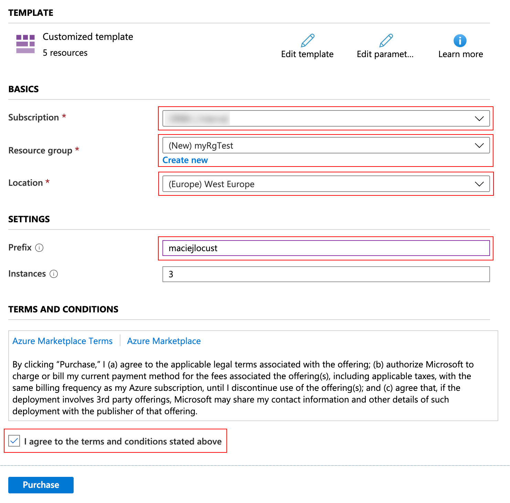
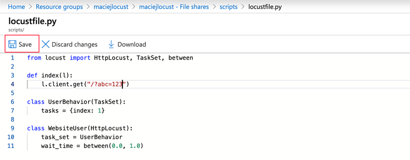

# Azure Locust

Run distributed [Locust](https://locust.io/) load tests on _Azure Container Instances_. It's quick, cheap and scalable! Using 20 slaves you can achive ~12 000 req/s!


#### Before you start
Choose some namespace for identity your resources. 
It will be helful if you works on shared subscription and names have to be unique (ex. Storage Account and Resource Group)
It will be called **Namespace** and append to all resources you create. 
Please use only lowercase and digits. 

**Example namespace:** *maciejlocust*

You can deploy and manage resources using both: 
* [Azure Portal](https://portal.azure.com) - easier
* [Azure Cli](https://docs.microsoft.com/en-us/cli/azure/install-azure-cli?view=azure-cli-latest) - faster 

## Deployment

### Azure Portal

Click magick button:

[](https://portal.azure.com/#create/Microsoft.Template/uri/https%3A%2F%2Fraw.githubusercontent.com%2FORBA%2Fazure-locust%2Fmaster%2Fazuredeploy.json)

- Choose your Subscription
- **Select existing Resource Group or create new - name must be your namespace**
- As location choose West Europe
- Scaling: if you want change number of instnace (instance performance ~600rps)



### Azure Cli

**Step 1:** Choose your namespace
```
export NAMESPACE=<Namespace>
```

**Step 2:** Create Resource Group
```
az group create --name ${NAMESPACE} --location westeurope
```

**Step 3:** Deploy ARM template
```
az group deployment create --resource-group ${NAMESPACE} --template-file azuredeploy.json
```
if you want more instance append `--parameters instances=N`

## Go to dashboard

When deployment completes, your load generator is ready. Go to `<Namespace>-master.westeurope.azurecontainer.io:8089`


## Updating script

**Azure Portal:** Go to Azure portal and Storage Account named `<Namespace>`. 
Click _File shares_ (scoll panel down).
Go to share called _scripts_ and edit `locustfile.py`
Paste contents of your new file and click _Save_.



Then reset all containers called *master* and *slave*.


**Azure Cli:** Upload your custom script (you can change `--source` param if you want use different .py file):
```
az storage file upload --account-name ${NAMESPACE} -s scripts --source locustfile.py --path locustfile.py
```
Then reset containers:
```
az container list --resource-group ${NAMESPACE} --query '[].name' -o tsv | xargs -I {} az container restart --no-wait --resource-group ${NAMESPACE} --name {} 
```


## Cleanup


**Azure Portal:** Go to Resource Group called `<Namespace>` and remove it.


**Azure Cli:** Remove resources from Azure:
```
az group delete --name ${NAMESPACE} --yes
```

## Disclaimer

* Load test affects target service performance. Never run load tests without service owner permission!
* Some services can block traffic from generator - you should whitelist Azure Region IPs ([Download Prefixes](https://www.microsoft.com/download/details.aspx?id=56519)).
* After load tests cleanup Azure resources. You will be billed for running Azure Contianers Instance and Storage Account usage. You can check cost of ACI [here](https://azure.microsoft.com/en-us/pricing/details/container-instances/).